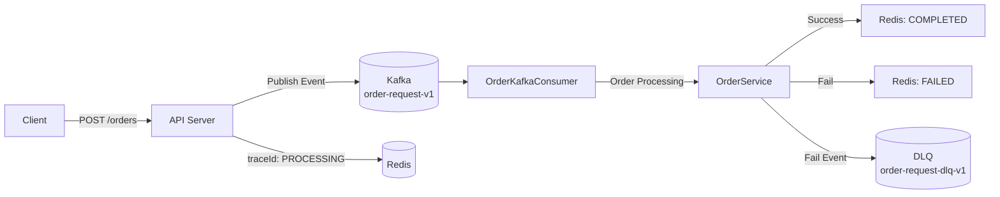

# Case Study: '네고왕' 이벤트의 성능 한계 극복을 위한 주문 시스템 재설계

## 개요
‘네고왕’과 같은 대규모 프로모션 이벤트는 짧은 시간 내에 폭발적인 주문 트래픽이 발생합니다.    
기존 시스템은 동기 처리 구조로 인해 병목 / DB 락 경합 / 장애가 반복되었습니다.

본 프로젝트에서는 서버 안정성을 확보하고 재고 일관성을 보장하기 위해  
**이벤트 기반 아키텍처 + 헥사고날 아키텍처 + 낙관적 락 + Redis 상태 추적**을 기반으로 한 주문 시스템을 재설계했습니다.

---

## 💡 문제 (AS-IS)

### 1) 동기식 처리 병목
- API 서버가 주문 → 재고 차감 → 주문 생성까지 모두 직접 처리
- 트래픽 폭주 시 DB 커넥션 풀 고갈
- 응답 지연 및 전체 서비스 장애 발생

### 2) 강한 결합
- 재고 검증, 주문 생성, 상태 처리 로직이 한곳에 뭉쳐있음
- 단일 실패가 전체 장애로 확산

### 3) 데이터 일관성 붕괴
- 비관적 락(Pessimistic Lock) 사용으로 DB 락 경합 증가
- 동시 재고 차감 시 성능 급격히 감소

---

## ⚙️ 해결 (TO-BE)

### 1) 🔁 Kafka 기반 비동기 주문 접수
- `/api/v1/orders` → Kafka 메시지 발행
- API 서버는 **202 Accepted + traceId** 즉시 반환
- 무거운 로직은 모두 백그라운드 처리

```kotlin
// RequestOrderService.kt - (Application Layer)
@Service
class RequestOrderService(
    private val sendOrderRequestPort: SendOrderRequestPort,
    private val saveOrderTracePort  : SaveOrderTracePort,
): RequestOrderUseCase {
    override fun requestOrder(command: OrderCommand): String {
        val traceId = command.traceId
        
        // 1. [Redis] 상태를 'PROCESSING' 으로 먼저 기록
        val status = OrderTraceResult(status = OrderTraceStatus.PROCESSING)
        saveOrderTracePort.save(traceId, command.memberId, status)

        // 2. [Kafka] 주문 메시지를 토픽으로 전송
        sendOrderRequestPort.send(command)
        
        // 3. [API] traceId 즉시 반환
        return traceId
    }
}
```

### 2) 🧱 헥사고날 아키텍처 적용
- Domain / Application 로직을 외부 기술에서 완전 분리
- Port-Adapter 구조로 테스트 용이성 및 확장성 증가




### 3) 🔐 낙관적 락(@Version)
- ProductEntity에 `@Version` 필드 추가
- 동시 재고 차감 시 충돌을 감지해 ObjectOptimisticLockingFailureException 발생
- DB 락 경합 없이 데이터 일관성 유지

```kotlin
// ProductEntity.kt - (Adapter Layer)
@Entity
@Table(name = "product")
class ProductEntity(
    // ...
    @Version // 1. JPA @Version 필드
    val version: Long = 0L 
)

// OrderService.kt - (Application Layer)
    try {
        // ... (재고 차감 로직) ...
        
        // 2. 수정 시 JPA가 Entity의 version을 자동 검증
        saveProductPort.saveAll(updatedProducts) 
        
        // ...
    } catch (e: ObjectOptimisticLockingFailureException) {
        // 3. 동시성 충돌 감지 시 예외 처리
        throw IllegalStateException("재고 처리 중 충돌이 발생했습니다.", e)
    }
    // ...

```

### 4) 📡 Redis 기반 주문 상태 추적
- 주문 접수 → Redis: PROCESSING
- 주문 처리 성공 → COMPLETED
- 주문 처리 실패 → FAILED
- 클라이언트는 traceId로 Polling 조회

```kotlin
// OrderKafkaConsumer.kt - (Adapter Layer)
@KafkaListener()
fun handleOrderRequest(command: OrderCommand?) {
    // ... (포이즌 필 체크) ...
    try {
        // 1. 주문 로직 실행
        val createdOrder = orderUseCase.order(command!!)
        
        // 2. [Redis] 성공 시 'COMPLETED' 기록
        val status = OrderTraceResult(
            status  = OrderTraceStatus.COMPLETED,
            orderId = createdOrder.id
        )
        saveOrderTracePort.save(command.traceId, command.memberId, status)

    } catch (e: Exception) {
        // 3. [Redis] 재고 부족/충돌 시 'FAILED' 기록
        log.error("주문 처리 실패: traceId={}, error={}", command.traceId, e.message)
        val status = OrderTraceResult(status = OrderTraceStatus.FAILED) 
        saveOrderTracePort.save(command.traceId, command.memberId, status)
        
        // 4. [DLQ] 실패한 메시지 전송
        sendOrderRequestPort.sendToDlq(command)
    }
}
```

---

## 🔁 네고왕 주문 처리 흐름 (Mermaid 다이어그램)



# '네고왕' 주문 시뮬레이션 리포트

## 🧪 시나리오
* **상품:** 3종
* **각 재고:** 500개
* **동시 요청:** 1000명 (각각 1개 주문)

---

### 1) API 요청 단계 (0.1초 ~ 2초)
* 1000개의 스레드가 동시에 `/api/v1/orders` 호출
* API 서버는 1000건 모두 **202 Accepted** 응답
* Kafka 토픽에 1000개의 주문 메시지 발행
* Redis에는 1000개의 `traceId`가 모두 **PROCESSING**으로 기록됨

### 2) Kafka 처리 단계 (1초 ~ 15초)
* `OrderKafkaConsumer`는 단일 Partition에서 메시지를 순차적으로 처리
* **1~500번 주문** → 재고 차감 성공 (`version` 0~499)
* **501번째 주문**부터 → `IllegalArgumentException`(재고 부족) 또는 `ObjectOptimisticLockingFailureException`(동시성 충돌) 발생
* 실패한 주문 메시지는 DLQ(`order-request-dlq-v1`)로 이동

### 3) 결과 (30초 내 완료)

| 항목 | 수치 |
| :--- | :--- |
| **총 요청** | 1000 |
| **성공(COMPLETED)** | 500 |
| **실패(FAILED)** | 500 |
| **최종 재고** | 0 |

---

## ✅ 검증 결과
* **데이터 일관성:** 재고가 음수(-)가 되거나 `version`이 꼬이지 않음
* **중복 처리 방지:** 중복 주문이 발생하지 않음
* **시스템 안정성:** 서버 다운(Crash) 없이 1000건의 주문을 모두 처리 (성공 또는 실패)
* **정확한 상태 분리:** 성공(COMPLETED) 500건, 실패(FAILED) 500건이 Redis에 정확히 기록됨
* **장애 추적:** 실패한 500건의 주문은 DLQ로 이동하여 실패 원인 추적 가능

---

## 기대 효과

| 효과 | 설명 |
| :--- | :--- |
| **시스템 안정성** | Kafka가 트래픽의 완충(Buffer) 역할을 수행하여 API 서버 장애 방지 |
| **처리량/응답성 향상** | 외부 I/O가 제거된 API가 202 Accepted를 즉시 반환하여 매우 빠른 응답 속도 보장 |
| **데이터 일관성** | 낙관적 락(`@Version`)을 통해 DB 락 경합 없이 재고의 무결성 보장 |
| **확장성** | 헥사고날 아키텍처 덕분에 Kafka, Redis 등 외부 기술 교체 및 확장이 용이 |

---

## 기술 스택
* Kotlin, Spring Boot, JPA
* Kafka, Redis, MySQL
* Docker, AWS
* Hexagonal Architecture, Event-driven Architecture

## GitHub Repository
👉 `https://github.com/limjeahun/order-management-system.git`